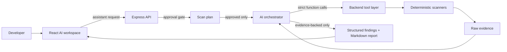

# BugHunter AI

> Your AI Application Security Engineer

BugHunter AI turns an authorized application-security assessment into a guided conversation. It combines deterministic web-security scanners with an AI reasoning layer so developers receive evidence-backed findings, remediation guidance, and a developer-ready report—not a wall of scanner output.

Built for **OpenAI Build Week 2026 · Developer Tools**.

## Why it matters

Security tools are powerful, but their workflow can be intimidating: configure modules, interpret noisy output, and translate it into an engineering plan. BugHunter AI keeps scanners as the source of truth, while an AI assistant plans authorized checks, calls only approved backend tools, correlates their evidence, and explains what a developer should do next.

## Demo in 30 seconds

1. Start the API and React app.
2. Click **Analyze Demo Application**.
3. Watch the scan timeline progress through a safe, deterministic assessment.
4. Review the executive summary, evidence-backed findings, remediation examples, and exportable report.

The demo never sends a network request and does not require `OPENAI_API_KEY`. It uses a scanner-shaped evidence fixture at `https://demo.bughunter.ai`, designed solely for a predictable presentation.

> **Screenshot placeholder 1 — AI workspace:** Replace with a hero capture showing the conversational input, demo CTA, and scan timeline.

> **Screenshot placeholder 2 — evidence-backed findings:** Replace with an expanded finding that shows tool evidence, remediation, and export controls.

## Features

- Conversational, authorization-gated assessment planning
- Passive or explicitly approved active testing scope
- Deterministic scanners for headers, endpoints, crawl, sensitive data, reflected input, SQLi heuristics, and IDOR checks
- Strict function schemas for every model-callable tool
- Evidence-only assessment boundary: findings without executed scanner evidence are removed
- Premium dark AI workspace with live timeline, structured findings, and clear empty/error states
- Markdown and PDF report export
- Advanced Scanners drawer that preserves direct access to the original modules
- One-click, fixture-backed demo mode for Build Week judging

## Architecture



For a deeper component and trust-boundary explanation, see [docs/architecture.md](docs/architecture.md).

## AI workflow

1. A developer describes an authorized target and goal.
2. BugHunter AI asks for explicit authorization and whether active testing is allowed.
3. It shows the exact plan, scope, request estimate, and non-destructive posture.
4. After approval, the configured AI layer may call only approved backend tools with strict JSON schemas.
5. Deterministic scanners collect evidence; GPT-5.6 correlates and explains it.
6. A final guard removes any model finding not linked to tools that ran.
7. The UI renders structured findings and an exportable report.

## GPT-5.6 usage

The backend keeps model access behind the server-side orchestrator. Models do not receive unrestricted network tools; instead, the configured AI layer can invoke a limited allowlist of strict-schema backend functions such as `run_header_scan`, `run_crawl`, and `run_sqli_scan`, while deterministic scanner evidence remains the source of truth.

## Codex usage

Codex was used as the engineering collaborator for this Build Week project: it inspected the existing scanner repository, preserved and modularized scanner behavior, built the orchestrator and React workspace incrementally, generated submission materials, and ran regression/build checks. The product itself does not require Codex at runtime. Learn more about [OpenAI Codex](https://openai.com/codex/).

## Local setup

### Requirements

- Node.js 18+
- npm
- An AI provider key for real assessments after plan approval

### Install

```bash
git clone <your-repository-url>
cd BugHunter
npm install
cd bughunter-ui && npm install && cd ..
cp .env.example .env
```

### Configure

```bash
# .env
OPENAI_API_KEY=your_api_key
OPENAI_MODEL=gpt-5.6
FALLBACK_AI_API_KEY=your_fallback_key
FALLBACK_AI_MODEL=gemini-2.5-flash
BUGHUNTER_ALLOW_PRIVATE_TARGETS=false
BUGHUNTER_FRONTEND_ORIGIN=http://localhost:3000
```

For a separately deployed API, add this to `bughunter-ui/.env`:

```bash
REACT_APP_API_BASE_URL=https://your-api.example.com
```

### Run

In one terminal:

```bash
npm start
```

In another:

```bash
cd bughunter-ui
npm start
```

Open `http://localhost:3000`. The API defaults to `http://localhost:5001`.

## API contracts

| Endpoint | Purpose |
| --- | --- |
| `POST /api/assistant/message` | Authorization-gated GPT-5.6 assessment workflow |
| `POST /api/assistant/demo` | Safe deterministic Build Week demo assessment |
| `POST /headers`, `/endpoints`, `/crawl`, etc. | Existing focused scanner APIs |

See [docs/feature-overview.md](docs/feature-overview.md) for the feature map and [docs/demo-script.md](docs/demo-script.md) for the presentation flow.

## Verification

```bash
npm test
npm run check
cd bughunter-ui && CI=true npm test -- --watchAll=false
cd bughunter-ui && npm run build
```

## Safety posture

Only test systems you own or have explicit permission to assess. Real scans require authorization and plan approval. The demo endpoint is fixture-backed and intentionally isolated from the real scanning path.

## Future roadmap

- Streaming tool/timeline events from the backend
- Saved assessment history and comparison views
- Authenticated scan profiles and CI integration
- Broader framework-specific remediation guidance
- Human verification workflow and issue-tracker export

## Project documents

- [Demo script](docs/demo-script.md)
- [Judge’s guide](docs/judges-guide.md)
- [Architecture](docs/architecture.md)
- [Feature overview](docs/feature-overview.md)
