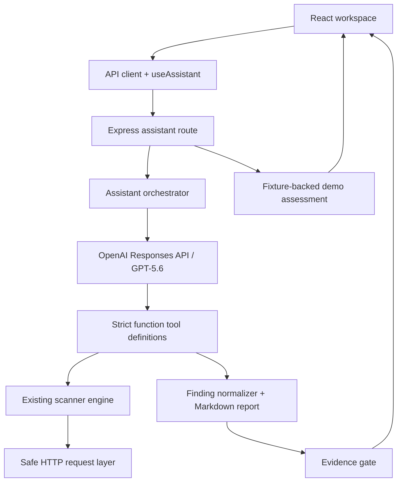

# Architecture

## System map

## Frontend

- `App.js` composes the workspace rather than owning scanner behavior.
- `useAssistant` owns assistant state, approval gates, error state, timeline state, and demo flow.
- `api/client.js` is the only frontend network boundary.
- Components render contracts returned by the backend; they do not duplicate scanner logic.

## Backend

- Existing scanner routes remain available.
- `server/ai/assistantOrchestrator.js` owns target extraction, authorization gates, plan creation, tool loop, and evidence filtering.
- `server/ai/toolDefinitions.js` provides the model’s allowlisted strict-schema functions and normalizes raw scanner output.
- `server/http/safeRequest.js` applies target and request safety controls.
- `server/demo/demoAssessment.js` returns a local, static evidence fixture for judging. It does not call OpenAI or the network.

## Security boundaries

1. Real requests must contain a valid HTTP(S) target.
2. The user confirms authorization and chooses passive versus active scope.
3. The user approves the exact generated plan.
4. Only tools from that plan are exposed to GPT-5.6.
5. The final evidence gate retains only findings that cite executed tools.

This design separates data collection from AI reasoning: scanners collect; GPT-5.6 plans, correlates, and communicates.
